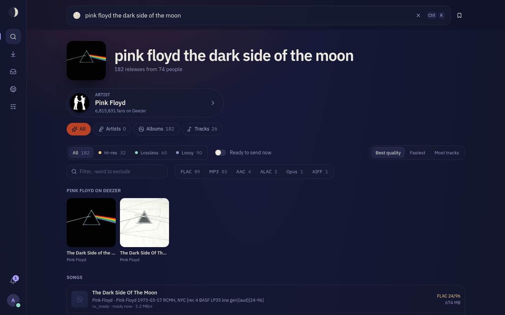
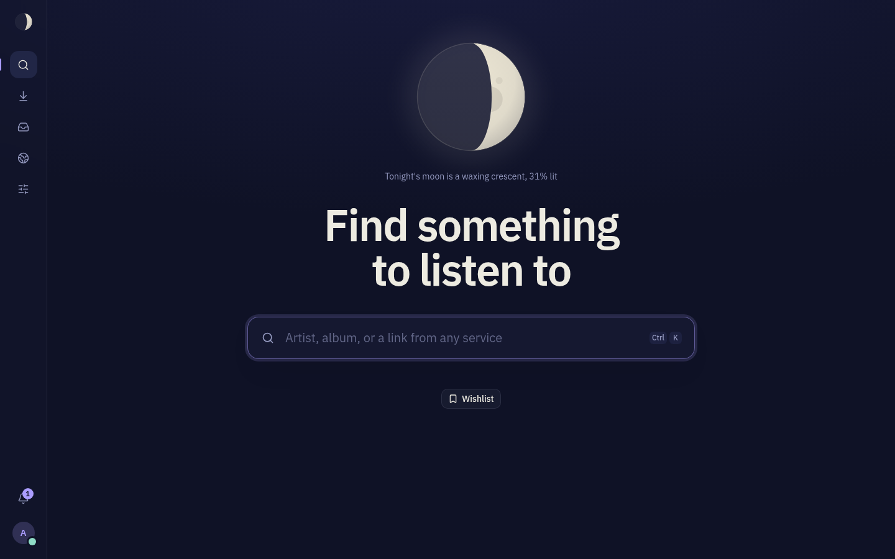
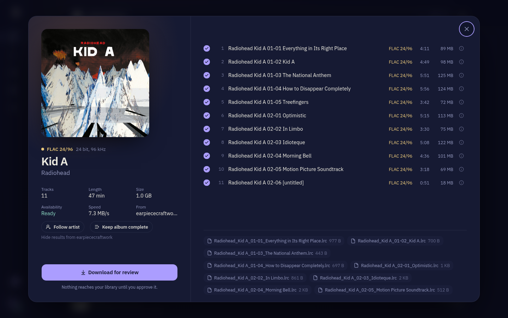
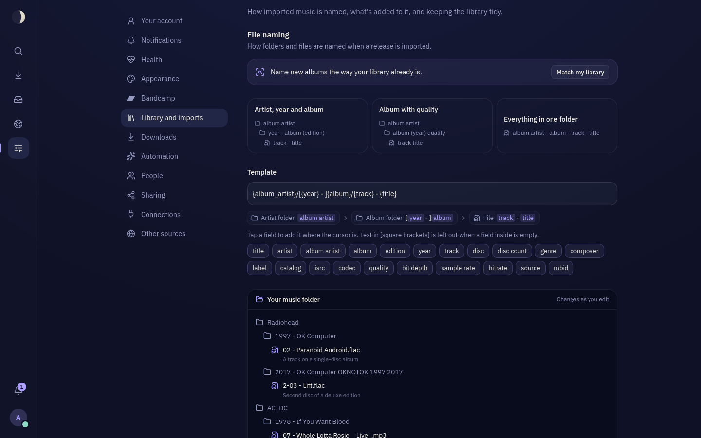
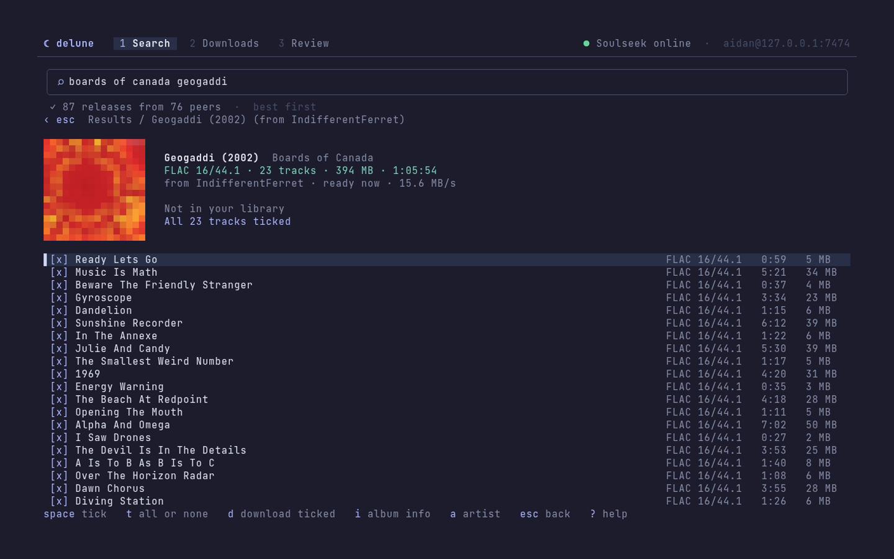
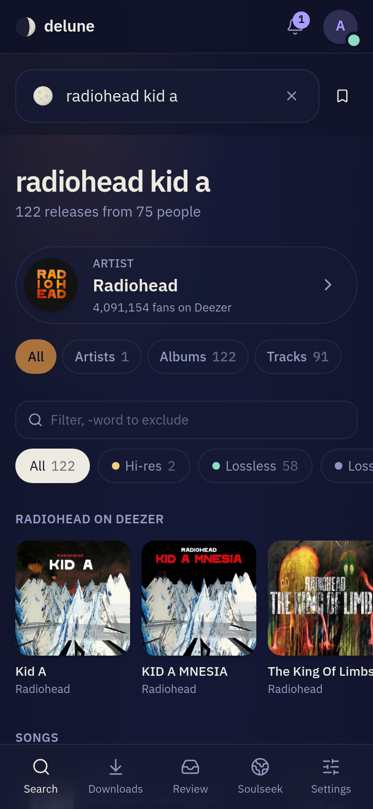
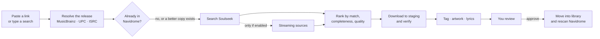

<div align="center">


# delune

**Find music, check it, and file it into Navidrome. Soulseek first.**

A self-hosted server with a web UI and a terminal UI. Paste a link from any
service or type what you're looking for; delune finds the best copy on Soulseek,
lets you review it, and puts it in your library with the tags, artwork, lyrics and
file names you asked for.

[](https://github.com/PndaMan/delune/actions/workflows/ci.yml)
[](https://pndaman.github.io/delune/)
[](LICENSE)
[](https://www.rust-lang.org)
[](https://pndaman.github.io/delune/install/script.html)

**[Documentation](https://pndaman.github.io/delune/)** ·
[Quick start](https://pndaman.github.io/delune/quick-start.html) ·
[Install](https://pndaman.github.io/delune/install/script.html) ·
[Troubleshooting](https://pndaman.github.io/delune/operate/troubleshooting.html)



</div>

> [!NOTE]
> **delune works end to end** — search, download, review, import, sharing — and runs in
> production next to its author's Navidrome, but there's no tagged release yet, so
> install [from source](https://pndaman.github.io/delune/install/source.html) or with
> [Nix](https://pndaman.github.io/delune/install/nixos.html) for now. Progress is in the
> [roadmap](docs/ROADMAP.md).

<table>
  <tr>
    <td width="50%"></td>
    <td width="50%"></td>
  </tr>
  <tr>
    <td align="center">Search, under tonight's actual moon phase</td>
    <td align="center">Every release opens with its artwork and tracks to pick from</td>
  </tr>
  <tr>
    <td width="50%"></td>
    <td width="50%"></td>
  </tr>
  <tr>
    <td align="center">Name files your way, previewed as a folder tree</td>
    <td align="center"><code>delune-tui</code>: the whole flow in a terminal, covers included</td>
  </tr>
</table>

<p align="center">
  
  <br><sub>Designed for phones, and installable as an app</sub>
</p>

## Why

Getting an album into a self-hosted library usually means juggling a Soulseek
client, a link converter, a tagger and a file manager, then waiting for a scan.
delune is one tool for the whole path, built around a few rules:

- **Soulseek is always searched first.** Streaming services are only used if you
  switch them on.
- **Nothing reaches your library without review.** You see the tracklist,
  quality, artwork and any problems before you approve an import.
- **Your library's conventions win.** delune learns how your existing folders are
  named and follows them; every detail is adjustable.
- **It's a good Soulseek citizen.** It shares your library, rate-limits searches and
  respects other people's upload queues.

## How it works



The server runs on the same machine as Navidrome, because Navidrome has no upload
API: delune writes into the music folder and then asks Navidrome to rescan just
that folder. The web UI and the terminal client are both clients of the server's
HTTP API, so `delune-tui` runs on your laptop and finds the server from its address
or your Navidrome's.

## Features

**Find**
- Search Soulseek, or paste a link from Spotify, Apple Music, Tidal, Qobuz, Deezer,
  YouTube Music, SoundCloud, Bandcamp or MusicBrainz. Links resolve to the release,
  and results rank by how much of its tracklist each folder holds.
- Paste a Spotify or Deezer playlist to put its songs, or their albums, on the wishlist.
- Results ranked lossless first, complete before partial, then resolution and
  availability, with artwork, "in library" and "N missing" badges, and filters.
- A wishlist that keeps searching and downloads good copies for review. Follow an
  artist and their new albums join it; upgrading lossy albums is opt-in.
- Artist, album and song pages (with lyrics) that open from anywhere and share as links.
- Search results lead with the artist you named, and switch between artists, albums
  and single songs; a song downloads on its own, with its album's cover.
- New releases from the artists you follow, and a notification when one arrives
  (on your phone, in ntfy or on Discord).

**Soulseek, natively** (no slskd)
- Searching, downloads with queue position, resume and retry, stop and resume.
- Browse anyone's shares and profile; any folder opens like a search result.
- Star favourite people: their shares are kept, so they open instantly.
- Private messages and chat rooms.
- Share your library (opt-in): uploads with slots, speed limits, per-person queues,
  blocking, a leecher policy, and the distributed search network, so people find you.
- Uploads you can follow: who downloaded what, your ratio, and totals kept across restarts.

**Check and import**
- Every download waits for review. Each file is decoded, and transcodes posing as
  FLAC are flagged.
- Naming templates with live preview, matched to your library; imports land in the
  Navidrome folder and trigger a scan.
- Synced lyrics from LRCLIB (a sidecar `.lrc`, in the tags, or both) and cover art on
  every import, from Deezer when the download has none.
- Better copies replace worse ones; tracks you add join the album you already have,
  renumbered to its current tracklist. Keep an album complete as the artist adds to it.
- A library check that merges albums split over folders, makes tracks agree on which
  album they're on, and removes doubled tracks. Nothing is deleted: every change can be
  undone.
- Add music you already have: tracks, a folder or a zip, checked like any download.

**Bandcamp and SoundCloud**
- Albums show their Bandcamp price, with a link to buy there (delune never takes payment).
- Link your own Bandcamp account: purchases are listed, albums you own say so, and
  "Get the files" downloads them for review.
- Artist pages show the artist's SoundCloud and newest tracks. Follow them there and
  new tracks join the wishlist; free downloads open where the artist offers them.
  Only public pages and SoundCloud's own RSS feeds are read, and no audio is pulled
  from SoundCloud.

**People**
- Sign in with Navidrome accounts; Navidrome admins are admins.
- Per-person permissions and an optional admin approval step.
- Profile pictures, themes (Night, Blue hour, Midnight, Forest) and accents.

**Everywhere**
- A web app that installs as a PWA and is designed for phones, not just shrunk to fit.
- `delune-tui`, a terminal client for any machine that does the whole flow: search,
  download, review, import.
- `delune setup`, a terminal wizard that configures and starts everything.
- A NixOS module, a Docker image, an Arch package and a Homebrew formula.

Planned: transcoding options, and release binaries and packages. Streaming sources come last, and only if you opt in.

## Quick start (development)

You need Rust 1.90+ and [Bun](https://bun.sh).

```sh
git clone https://github.com/PndaMan/delune && cd delune

# Web UI (rebuild whenever you want it embedded in the binary)
(cd web && bun install && bun run build)

# Server on http://localhost:7474
cargo run -- serve

# In another terminal: the terminal client
cargo run -p delune-tui -- localhost
```

To search, give the server a Soulseek account (a new username is registered the
first time it logs in):

```sh
DELUNE_SLSK_USERNAME=you DELUNE_SLSK_PASSWORD=secret cargo run -- serve
```

For web development, `scripts/dev.sh` runs the API server and the hot-reloading
web UI together; open http://localhost:5173.

### Accounts

Point delune at Navidrome and everyone signs in with their Navidrome account;
Navidrome admins are delune admins ([ADR 0006](docs/adr/0006-navidrome-accounts.md)):

```sh
DELUNE_NAVIDROME_URL=http://localhost:4533 \
DELUNE_NAVIDROME_USERNAME=admin DELUNE_NAVIDROME_PASSWORD=secret \
cargo run -- serve
```

Without Navidrome, delune runs in **open mode**: no sign-in, and whoever can reach
it is an admin. Keep an open-mode server off the internet.

## Install

The quickest way, on Linux or macOS:

```sh
curl -fsSL https://raw.githubusercontent.com/PndaMan/delune/main/install.sh | sh
```

It works out your system (Linux or macOS, Intel or ARM), installs `delune` and
`delune-tui` from the latest release (checking the download's checksum; the Linux
builds are static, so they run on any distribution, NixOS included) and starts
`delune setup`: a wizard in the terminal that asks
for your music folder, Navidrome and Soulseek, tries each one, writes the settings,
and sets delune up as a systemd service. Run `delune setup` again any time.

Run the script again to upgrade, or with `--uninstall` to remove delune (your data
stays). `sh -s -- --help` lists the rest: a specific `--version`, `--bin-dir`,
`--no-setup`, `--dry-run` and more. The
[install guide](https://pndaman.github.io/delune/install/script.html) has the details.

On another computer, `delune-tui myserver` connects to it. Give it delune's address,
the host name, or your Navidrome's address; it looks next to Navidrome, remembers
where it found delune, and keeps you signed in.

However you install it, you can also open delune in a browser the first time: it asks for your
music folder, Navidrome and a Soulseek account, checks each one, and saves them to
`config.toml` in its data folder (readable only by delune). Flags and `DELUNE_*`
environment variables still work and take precedence; settings made that way show
as fixed in the web UI.

### NixOS

delune is a flake with a NixOS module:

```nix
{
  inputs.delune.url = "github:PndaMan/delune";

  outputs = { nixpkgs, delune, ... }: {
    nixosConfigurations.server = nixpkgs.lib.nixosSystem {
      modules = [
        delune.nixosModules.default
        {
          services.delune = {
            enable = true;
            libraryDir = "/srv/music";               # the folder Navidrome scans
            group = "navidrome";                     # so it can write there
            soulseek.username = "your-name";
            navidrome.url = "http://127.0.0.1:4533";
            navidrome.username = "admin";
            environmentFile = "/run/secrets/delune.env"; # DELUNE_SLSK_PASSWORD, DELUNE_NAVIDROME_PASSWORD
            openFirewall = true;                     # the Soulseek port
          };
        }
      ];
    };
  };
}
```

The service listens on `127.0.0.1:7474`; put your reverse proxy in front of it.
`nix build github:PndaMan/delune` builds the binaries, and
`nix profile install github:PndaMan/delune` puts `delune-tui` on your path.

**Through a VPN.** Soulseek shows peers your IP address. To keep delune's traffic on a
VPN (and stop it if the VPN drops), either run it inside a VPN container's network or
in a network namespace that only has the VPN:

```nix
services.delune.vpn.container = "gluetun";  # delune runs as a container in gluetun's network
services.delune.listen = "0.0.0.0:7474";    # publish 7474 and the Soulseek port on gluetun
services.delune.vpn.user = "1024:100";      # match the owner of a NAS music share

# or, with namespaced WireGuard:
services.delune.vpn.namespace = "wg";       # /run/netns/wg
```

Settings → Connections shows the address Soulseek sees, so you can check it's the VPN's.
With Docker, `compose.yaml` has the same setup with gluetun, commented out.

### Docker

```sh
cp .env.example .env   # optional: or set everything up in the browser
docker compose up -d
```

[`compose.yaml`](compose.yaml) mounts your music folder at `/music` and keeps
delune's own data in a volume.

### Arch Linux

[`packaging/aur/PKGBUILD`](packaging/aur/PKGBUILD) builds delune with a hardened
systemd service:

```sh
sudoedit /etc/delune/delune.env   # library folder, Soulseek and Navidrome details
sudo systemctl enable --now delune
```

The service can write to `/srv/music`. For a library elsewhere, `systemctl edit delune`
and add `ReadWritePaths=/path/to/music`.

### Homebrew and release binaries

Tagged releases publish binaries for Linux and macOS (x86_64 and ARM) on the
[releases page](https://github.com/PndaMan/delune/releases), and
[`packaging/homebrew/delune.rb`](packaging/homebrew/delune.rb) installs them
(`brew services start delune` runs it in the background). On other Linux systems,
copy the binary to `/usr/bin` and use the unit in [`packaging/systemd/`](packaging/systemd/).

## Other sources

delune downloads from Soulseek. It has no built-in downloaders for streaming
services: fetching from them means getting around their copy protection and terms,
which delune won't do. If you already have a downloader you trust, Settings has an
opt-in "Other sources" section where someone who manages delune can name a program
(`yt-dlp`, say) and its arguments. delune runs it for a link — directly, with no
shell, substituting only the link and the folder to write to — and whatever it
fetches goes through the same review before it reaches your library. The program
runs as the delune server, so only point it at something you'd run yourself.

## Project layout

```text
crates/
  delune            the server binary: `delune serve`, `delune setup`
  delune-core       domain types and pure logic: quality, providers, releases
  delune-soulseek   native Soulseek protocol client
  delune-resolve    link parsing and cross-service release matching
  delune-navidrome  Subsonic API client for Navidrome
  delune-library    naming templates, tagging, import into the library
  delune-server     HTTP API and embedded web UI
  delune-tui        the terminal client (`delune-tui`) and the setup wizard's screens
  delune-bandcamp   Bandcamp releases, prices and purchases
  delune-soundcloud SoundCloud profiles, feeds and tracks
web/                React + TypeScript web UI (shadcn/ui on Base UI)
docs/               architecture, decisions (ADRs), research, roadmap
```

Read [docs/ARCHITECTURE.md](docs/ARCHITECTURE.md) for how the pieces fit, and
[docs/adr/](docs/adr/) for why things are the way they are.

## Contributing

Issues and pull requests are welcome; start with
[CONTRIBUTING.md](CONTRIBUTING.md). Security problems go through
[SECURITY.md](SECURITY.md), not public issues.

## A note on use

delune is a tool for managing *your* music library. Soulseek is a file-sharing
network: share what you're comfortable sharing and respect the network's rules.
Streaming integrations are off by default, and using them may break those
services' terms. You're responsible for what you download and where you live.

## License

[AGPL-3.0-or-later](LICENSE). If you run a modified delune as a service for other
people, you must offer them your source.
