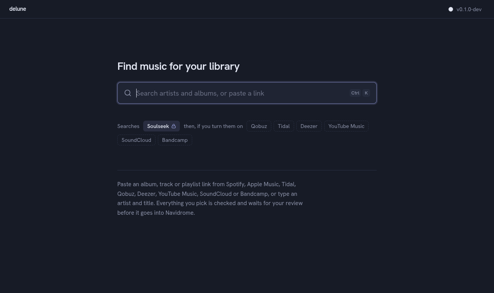
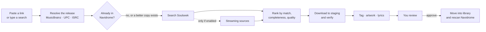

<div align="center">

# delune

**Find music, check it, and file it into Navidrome. Soulseek first.**

A self-hosted server with a web UI and a terminal UI. Paste a link from any
service or type what you're looking for; delune finds the best copy on Soulseek,
lets you review it, and puts it in your library with the tags, artwork, lyrics and
file names you asked for.

[](https://github.com/PndaMan/delune/actions/workflows/ci.yml)
[](LICENSE)



</div>

> [!WARNING]
> **delune is in early development and can't download anything yet.** Live
> Soulseek search works from the API and the terminal UI; the first working
> release (v0.1) is tracked in the [roadmap](docs/ROADMAP.md). Star or watch the
> repo to follow along.

## Why

Getting an album into a self-hosted library usually means juggling a Soulseek
client, a link converter, a tagger and a file manager, then waiting for a scan.
delune is one tool for the whole path, built around a few rules:

- **Soulseek is always searched first.** Streaming services are only used if you
  switch them on.
- **Nothing reaches your library without review.** You see the tracklist,
  quality, artwork and any problems before you approve an import.
- **Your library's conventions win.** delune learns how your existing folders are
  named and follows them; every detail is adjustable.
- **It's a good Soulseek citizen.** It shares your library, rate-limits searches and
  respects other people's upload queues.

## How it works



The server runs on the same machine as Navidrome, because Navidrome has no upload
API: delune writes into the music folder and then asks Navidrome to rescan just
that folder. The web UI and the TUI are both clients of the server's HTTP API, so
you can run `delune tui` from your laptop.

## Features

| | Status |
|---|---|
| Paste links from Spotify, Apple Music, Tidal, Qobuz, Deezer, YouTube Music, SoundCloud, Bandcamp, MusicBrainz | Link parsing done |
| Native Soulseek client (no slskd needed) | Live search working: login, reconnect, firewall piercing, rate limiting |
| Quality ranking (24/192 → 16/44.1 → lossy, with fake-FLAC detection) | Ranking done; fake-FLAC detection planned |
| "Already in library" and "better copy available" checks | Navidrome client done |
| File and folder naming templates with live preview | Template engine done |
| Review inbox with optional admin approval | Planned for v0.1 |
| Log in with your Navidrome account | Planned for v0.1 |
| Synced lyrics, embedded artwork, MP3/AAC transcoding | Planned for v0.1 |
| Playlist import, watchlist | Planned |
| Follow artists, automatic quality upgrades (off by default) | Planned |
| Opt-in streaming providers | Planned |

## Quick start (development)

You need Rust 1.90+ and [Bun](https://bun.sh).

```sh
git clone https://github.com/PndaMan/delune && cd delune

# Web UI (rebuild whenever you want it embedded in the binary)
(cd web && bun install && bun run build)

# Server on http://localhost:7474
cargo run -- serve

# In another terminal
cargo run -- tui
```

To search, give the server a Soulseek account (a new username is registered the
first time it logs in):

```sh
DELUNE_SLSK_USERNAME=you DELUNE_SLSK_PASSWORD=secret cargo run -- serve
```

For web development, `scripts/dev.sh` runs the API server and the hot-reloading
web UI together; open http://localhost:5173.

Docker images, a NixOS module, release binaries and AUR/Homebrew packages come
with v0.1. A development [`compose.yaml`](compose.yaml) is included.

## Project layout

```text
crates/
  delune            the binary: `delune serve`, `delune tui`
  delune-core       domain types and pure logic: quality, providers, releases
  delune-soulseek   native Soulseek protocol client
  delune-resolve    link parsing and cross-service release matching
  delune-navidrome  Subsonic API client for Navidrome
  delune-library    naming templates, tagging, import into the library
  delune-server     HTTP API and embedded web UI
  delune-tui        ratatui terminal client
web/                React + TypeScript web UI (shadcn/ui on Base UI)
docs/               architecture, decisions (ADRs), research, roadmap
```

Read [docs/ARCHITECTURE.md](docs/ARCHITECTURE.md) for how the pieces fit, and
[docs/adr/](docs/adr/) for why things are the way they are.

## Contributing

Issues and pull requests are welcome; start with
[CONTRIBUTING.md](CONTRIBUTING.md). Security problems go through
[SECURITY.md](SECURITY.md), not public issues.

## A note on use

delune is a tool for managing *your* music library. Soulseek is a file-sharing
network: share what you're comfortable sharing and respect the network's rules.
Streaming integrations are off by default, and using them may break those
services' terms. You're responsible for what you download and where you live.

## License

[AGPL-3.0-or-later](LICENSE). If you run a modified delune as a service for other
people, you must offer them your source.
