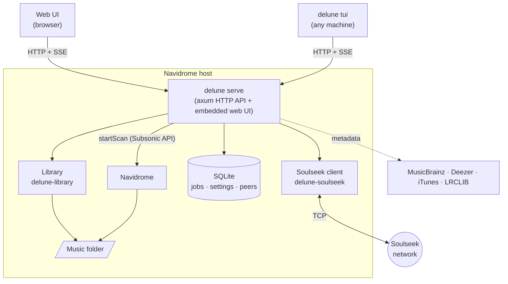
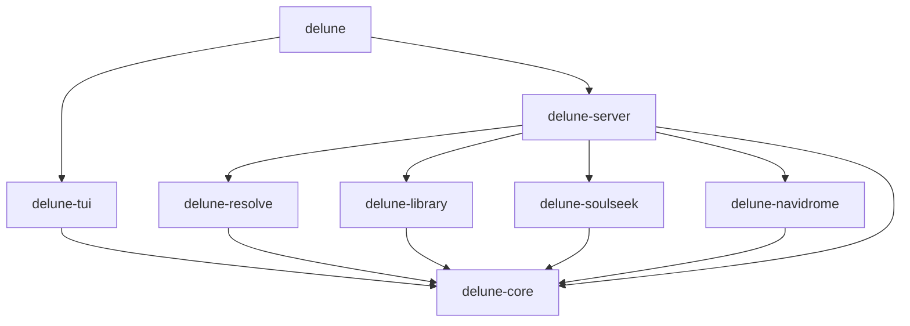

# Architecture

This document explains how delune is put together and where to find things. It's
meant to be read top to bottom once; after that, the crate-level docs
(`cargo doc --open`) are the detailed reference.

## The shape of the system

- **One server, two clients.** The server owns all state and all work. The web UI
  and the TUI are thin: they render what the API returns and send user intent back.
  Nothing is possible in one client that isn't possible over the API.
- **Same host as Navidrome.** Navidrome can't accept uploads, so delune needs write
  access to the music folder. See [ADR 0001](adr/0001-rust-single-binary.md).
- **One binary.** `delune` contains the server, the TUI and the compiled web UI.

## Crates

Dependencies point downward; nothing depends on `delune-server` except the binary.

| Crate | Responsibility | I/O? |
|---|---|---|
| `delune-core` | Shared vocabulary: `Quality`, `Provider`, `SourcePolicy`, `Release`, API types | None |
| `delune-resolve` | Understand pasted links; match a release across services | HTTP (resolution) |
| `delune-soulseek` | Speak the Soulseek protocol: server session, peers, search, transfers, sharing | TCP |
| `delune-navidrome` | Subsonic API: auth, ownership checks, scans | HTTP |
| `delune-library` | Naming templates, layout detection, tagging, verification, import | Filesystem |
| `delune-server` | HTTP API, job orchestration, persistence, web UI assets | All of the above |
| `delune-tui` | Terminal client | HTTP to the server |

Keeping pure logic in `delune-core` and at the bottom of each crate (for example
`delune-soulseek::wire`, `delune-library::naming`) means most behaviour is tested
without networks or disks.

## The main flow

What happens between typing into the search bar and a new album appearing in
Navidrome. Steps marked *(planned)* are not built yet.

1. **Classify input** — `delune_resolve::classify` decides whether the input is a
   link or text. Clients call `GET /api/v1/classify` as the user types so both UIs
   show the same "Spotify album" hint.
2. **Resolve** *(planned)* — links become a canonical release: MusicBrainz URL
   lookup first, then UPC (albums) and ISRC (tracks) to bridge services.
   See [ADR 0003](adr/0003-link-resolution.md).
3. **Check the library** *(planned)* — `search3` against Navidrome by MusicBrainz ID
   and by title. Owned at the same or better quality stops here with "Already in
   library".
4. **Search** *(planned)* — `SourcePolicy::search_order()` decides which sources are
   asked, and in what order. Soulseek is always first; this is enforced in one
   tested function rather than by convention.
5. **Rank** *(planned)* — candidates are grouped by folder, matched against the
   tracklist, and sorted by match confidence, completeness, `Quality::rank`, and
   peer availability. See [ADR 0004](adr/0004-quality-ranking.md).
6. **Download and verify** *(planned)* — files land in a staging folder, are decoded
   end to end, and checked for transcodes (fake FLAC).
7. **Prepare** *(planned)* — tags, artwork, synced lyrics and file names according
   to settings.
8. **Review** *(planned)* — the job waits in the requester's review inbox, and in the
   admin inbox too if admin approval is required. See [ADR 0005](adr/0005-always-review.md).
9. **Import** *(planned)* — an atomic move into the library, then a targeted
   `startScan`.

## API

- REST under `/api/v1`, JSON bodies, versioned by path.
- Long-running work streams progress over Server-Sent Events *(planned)*.
- Authentication with Navidrome credentials, exchanged for a session *(planned)*.
- The OpenAPI document will be generated from the Rust handlers (utoipa), and the
  web client's TypeScript types generated from that. Until then,
  `web/src/lib/api.ts` is hand-written and must be kept in step with
  `delune-core::api` and `delune-server`.

## Web UI

React 19, Vite, TanStack Query, Tailwind CSS v4 and shadcn/ui components on Base UI.
Built into `web/dist` and embedded into the binary with `rust-embed`; unknown paths
fall back to `index.html` for client-side routing, unknown `/api/*` paths return 404.

Design rules: dense and keyboard-first (⌘K / `/` focus search), one accent colour
that album artwork will override, Hanken Grotesk with tabular figures, designed
empty and error states, and correct at 400px wide.

## Terminal UI

ratatui with the standard single-state model: `App` holds state, `ui::draw` is a
pure function of it, and background tasks talk to the event loop over a channel
instead of touching the terminal. Album art via `ratatui-image` *(planned)*.

## Testing

- Unit tests live next to the code (`#[cfg(test)]`). Protocol and parser code is
  tested against byte-level fixtures and published test vectors.
- Server routes are tested in-process with `tower::ServiceExt::oneshot`.
- CI runs `cargo fmt --check`, `clippy -D warnings`, `cargo test`, and the web
  typecheck, lint and build on every push.
