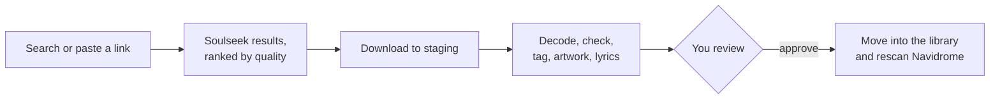

# delune

delune finds music on Soulseek (and Bandcamp and SoundCloud), checks every file, and
files it into your [Navidrome](https://www.navidrome.org/) library — but only after
you've looked at it. Think of it as *Overseerr for Soulseek*: the people who use your
Navidrome can search, ask for albums, and follow artists, and you decide what lands in
the library.

## What you get

- **One server** (`delune serve`) with a web app that installs on your phone, a native
  Soulseek client (no slskd), and an HTTP API.
- **A terminal client** (`delune-tui`) for any machine that can reach the server.
- **A setup wizard** (`delune setup`) that asks the questions, tries each connection,
  and sets delune up as a service.
- Sign-in with **Navidrome accounts**, per-person permissions, requests and approvals.
- A **wishlist** that keeps searching, **follows** for new releases, and optional
  **quality upgrades** of lossy albums.
- **Sharing** your library back on Soulseek, with slots, speed limits and schedules.
- **Bandcamp** prices and purchase downloads, **SoundCloud** artists and free
  downloads, and a hook for a downloader of your own.

## Where it runs

delune runs **next to Navidrome**, on the machine (or network share) that holds your
music, because Navidrome has no upload API: delune writes into the music folder and
asks Navidrome to rescan. The web app and the terminal client work from anywhere that
can reach the server.

If you just want it running, start with the [Quick start](quick-start.md).
