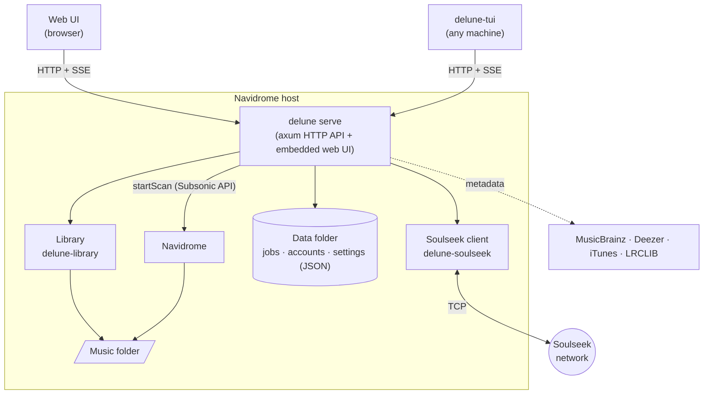
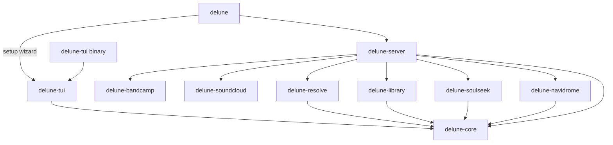

<!-- Generated from docs/ARCHITECTURE.md by scripts/docs-project-pages.py; edit that file instead. -->

# Architecture

This document explains how delune is put together and where to find things. It's
meant to be read top to bottom once; after that, the crate-level docs
(`cargo doc --open`) are the detailed reference.

## The shape of the system

- **One server, two clients.** The server owns all state and all work. The web UI
  and the TUI are thin: they render what the API returns and send user intent back.
  Nothing is possible in one client that isn't possible over the API.
- **Same host as Navidrome.** Navidrome can't accept uploads, so delune needs write
  access to the music folder. See [ADR 0001](https://github.com/PndaMan/delune/blob/main/docs/adr/0001-rust-single-binary.md).
- **Two binaries.** `delune` is the server with the compiled web UI, plus `delune
  setup`. `delune-tui` is the terminal client, small enough to install anywhere; it
  finds the server by its address, its host, or the Navidrome address next to it.

## Crates

Dependencies point downward; nothing depends on `delune-server` except the binary.

| Crate | Responsibility | I/O? |
|---|---|---|
| `delune-core` | Shared vocabulary: `Quality`, `Provider`, `SourcePolicy`, `Release`, API types | None |
| `delune-resolve` | Understand pasted links; match a release across services | HTTP (resolution) |
| `delune-soulseek` | Speak the Soulseek protocol: server session, peers, search, transfers, sharing | TCP |
| `delune-navidrome` | Subsonic API: auth, ownership checks, scans | HTTP |
| `delune-library` | Naming templates, layout detection, tagging, verification, import | Filesystem |
| `delune-server` | HTTP API, job orchestration, persistence, web UI assets | All of the above |
| `delune-bandcamp` | Bandcamp search, release pages, a fan's purchases and downloads | HTTP |
| `delune-soundcloud` | SoundCloud profiles, RSS feeds and track pages (no API keys) | HTTP |
| `delune-tui` | Terminal client, and the screens of `delune setup` | HTTP to the server |

Keeping pure logic in `delune-core` and at the bottom of each crate (for example
`delune-soulseek::wire`, `delune-library::naming`) means most behaviour is tested
without networks or disks.

## The main flow

What happens between typing into the search bar and a new album appearing in
Navidrome.

1. **Classify input**: `delune_resolve::classify` decides whether the input is a
   link or text. Clients call `GET /api/v1/classify` as the user types so both UIs
   show the same "Spotify album" hint.
2. **Resolve**: links become a release or track from each service's public metadata
   (`delune_resolve::Resolver`: Deezer and iTunes APIs, Spotify's embed page, oEmbed,
   JSON-LD, Open Graph, MusicBrainz), cached for an hour. Playlists become a list of
   songs to put on the wishlist. See [ADR 0003](https://github.com/PndaMan/delune/blob/main/docs/adr/0003-link-resolution.md).
3. **Search**: `SourcePolicy::search_order()` decides which sources are asked, in
   what order; Soulseek is always first, enforced in one tested function.
   `GET /api/v1/search` streams a `resolved` event for links, then results over
   Server-Sent Events as peers answer.
4. **Rank**: responses are grouped into one candidate per folder and sorted by
   lossless-first, completeness, `Quality::rank` and availability (`Candidate::rank`).
   For links, the web client ranks folders holding the linked tracklist first. See
   [ADR 0004](https://github.com/PndaMan/delune/blob/main/docs/adr/0004-quality-ranking.md). Library state (`/api/v1/library/album`)
   marks what Navidrome already has.
5. **Download**: `POST /api/v1/downloads` creates a job for a folder (or some of its
   files); every file is queued with the peer at once through
   `delune-soulseek::transfer` into `<data dir>/staging/<job>/`, resuming from
   `.part` files. Jobs survive restarts (saved in `delune.db`, see below) and can be stopped and resumed.
6. **Verify and plan**: every file is decoded end to end and checked for transcodes
   (`delune_library::verify`); tags and the naming template decide where each file
   goes (`delune_library::import::plan`), and conflicts are found before anything moves.
7. **Review**: the job waits for its requester; with approval required, for an admin.
   See [ADR 0005](https://github.com/PndaMan/delune/blob/main/docs/adr/0005-always-review.md).
8. **Import**: files move into the library (copying across filesystems), then in the
   background artwork is embedded, lyrics are fetched from LRCLIB, and Navidrome
   rescans (`delune_server::finishing`).

Beside the main flow: the **wishlist** repeats searches on Soulseek's wishlist
interval; **automation** follows artists and looks for quality upgrades; **sharing**
indexes the library, answers searches (including from the distributed network) and
serves uploads; **chat** keeps private messages and rooms.

## Storage

Everything delune keeps lives in its data directory:

- `delune.db`: one SQLite database (WAL mode, readable only by delune). Each part of
  the server saves its state as a JSON document under its own key (`jobs`,
  `accounts`, `wishlist`, `requests`, `notifications`, settings…), written in one
  transaction. A `peers` table records how downloads from each Soulseek user went,
  which breaks ties when ranking results. JSON files from before the database are
  imported on first start and kept as `*.json.imported`.
- `config.toml`: connections set from the web UI (library folder, Navidrome,
  Soulseek); flags and `DELUNE_*` variables override it.
- `staging/<job>/`: downloads waiting for review.
- `avatars/`, `share-cache.json`: profile pictures, and a cache of audio properties
  that makes re-indexing the library for sharing fast.

## API

- REST under `/api/v1`, JSON bodies, versioned by path.
- Search and chat stream over Server-Sent Events; downloads and uploads are polled.
- Sign-in checks Navidrome credentials and issues delune's own session: an
  `HttpOnly` cookie for browsers, a bearer token for the TUI. See
  [ADR 0006](https://github.com/PndaMan/delune/blob/main/docs/adr/0006-navidrome-accounts.md). Every route except health and the
  session needs one; permissions are checked per handler.
- `GET /api/v1/openapi.json` describes every route (OpenAPI 3.1, from `#[utoipa::path]`
  annotations on the handlers); a test fails if a registered route isn't described.
- `web/src/lib/api.generated.ts` is generated from `delune-core::api`
  (`scripts/generate-types.sh`), and `api-contract.ts` checks the hand-written web
  types against it at compile time. CI fails if the generated file is stale.

## Web UI

React 19, Vite, TanStack Query, Tailwind CSS v4 and shadcn/ui components on Base UI.
Built into `web/dist` and embedded into the binary with `rust-embed`; unknown paths
fall back to `index.html` for client-side routing, unknown `/api/*` paths return 404.

Design rules (full detail in [design/web-ui.md](https://github.com/PndaMan/delune/blob/main/docs/design/web-ui.md)): dense and keyboard-first (⌘K / `/` focus search), one accent colour
taken from album artwork, IBM Plex Sans with tabular figures, designed
empty and error states, and correct at 400px wide.

## Terminal UI

ratatui with the standard single-state model: `App` holds state, `ui::draw` is a
pure function of it, and background tasks talk to the event loop over a channel
instead of touching the terminal. Three screens (Search, Downloads, Review) cover
the whole flow; destructive actions ask for confirmation. Album art via
`ratatui-image` is planned.

## Testing

- Unit tests live next to the code (`#[cfg(test)]`). Protocol and parser code is
  tested against byte-level fixtures and published test vectors.
- Server routes are tested in-process with `tower::ServiceExt::oneshot`.
- The Soulseek client is tested end to end against fake servers and peers over real
  sockets: searching, downloading and resuming, browsing, chat, uploads, answering
  searches and joining the distributed network.
- Live tests (`cargo test -p delune-resolve --test live -- --ignored`) check link
  resolution against the real services.
- `nix flake check` boots a NixOS VM with the module and checks the service answers.
- CI runs `cargo fmt --check`, `clippy -D warnings`, `cargo test`, rustdoc with
  warnings denied, and the web typecheck, lint and build on every push.
